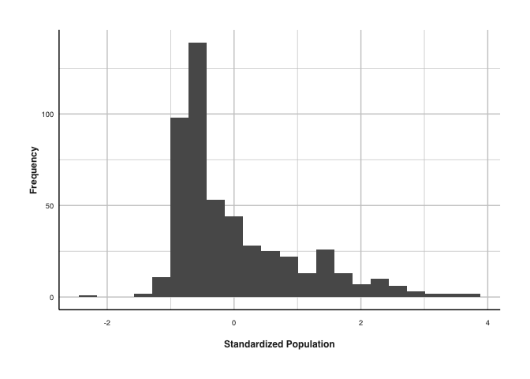
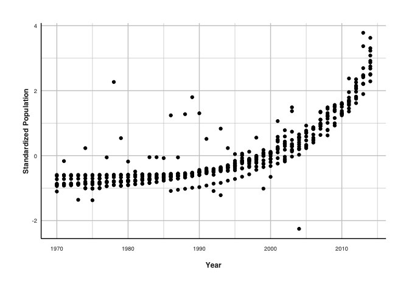
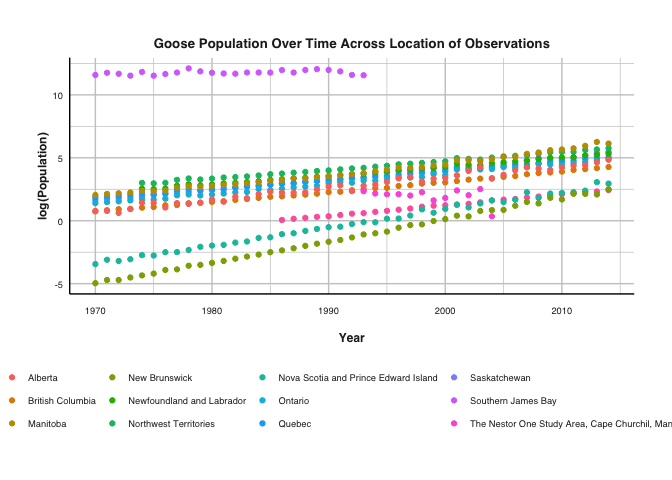
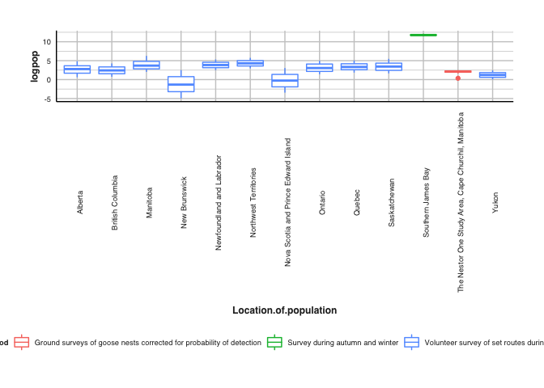
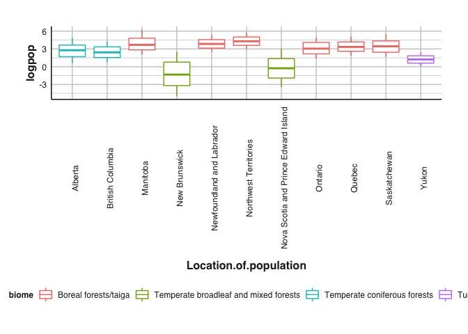
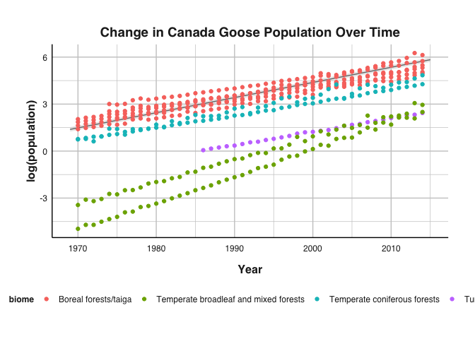
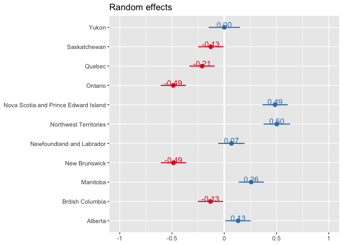
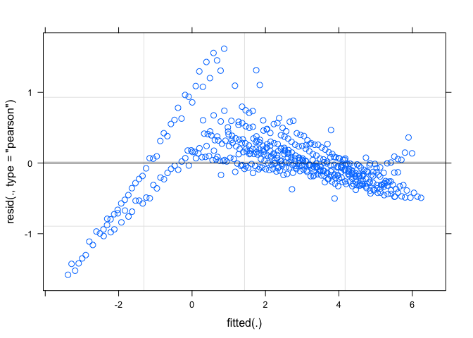

WWF Canada Goose Report
================
By “Xinzhou Du”
Published “11/17/2021”

## 1\. Introduction

Canada Goose *Branta canadensis* is one of the most populous waterfowl
species in North America. Previously, the species is known to migrate
from their breeding grounds in Canada to their winter ranges in parts of
the United States. However, with conditions in many of their breeding
habitat becoming more temperate in Canada, food source are less scarce
and consequently, less populations are migrating. With local populations
projected to increase, it is crucial for the World Wide Fund (WWF) as a
conservation organization to understand the population trend over time
and across landscapes to better estimate corresponding environmental
impacts. In summary, this report projects the population trend of the
Canada Goose in Canada and attempts to attribute such trends to various
factors.

For access to modeling code, please refer to `goose.R`. The R script
contains code used to clean and manipulate data, visualize data under
various factors, statistical analysis, and model construction.

### 1.1. Data Source

We utilize population data from [The Living Planet Index
(LPI)](https://livingplanetindex.org/home/index) to construct a mixed
effect model estimating how population of Canada Goose changes over
years and across biomes. The LPI database aggregates observation of
species populations from a large subset of studies around the world. For
Canada Goose in Canada, data are sourced from the following studies.

    ## # A tibble: 3 x 2
    ##   Data.source.citation                                                     count
    ##   <fct>                                                                    <int>
    ## 1 " Rusch, D. H., R. E. Malecki, et al. (1995). Canada Geese in North Ame…    24
    ## 2 "Environment Canada (2015). North American Breeding Bird Survey - Canad…   471
    ## 3 "Reiter, M. E. and D. E. Andersen (2011). Arctic foxes lemmings and Can…    12

All data used are open source and are available for use for any
registered users.

### 1.2. Research Question

Initially, we aim to investigate how does the abundance of Canada Goose
varies across `years` and `biome` while taking into account random
effects from location of monitoring, monitoring methods, and units
defining abundance. However, we have deviated from such question due to
lack of levels on certain variables and redundancies that we will dicuss
later.

Our reformed research question looks at the same trend by only include
the random effect of the **locations of observations (provinces of
Canada)**.

### 1.3. Hypothesis

Given the improved breeding ground conditions in Canada during winter,
we expect the abundance of Canada Goose to remain similar over time but
to differ across biome.

## 2\. Exploratory Analysis

### 2.1. Distribution of Population Abundance

The original data distribution is difficult to interpret in aggregate as
the sampling methods differ, resulting in different units of
observations. We then attempted to scale the data via standardization
(scaling by mean and standard deviation).

We then plotted the resulting distribution. At a glance, the data
appears to be heavily right skewed.

<!-- -->

This is further reflected in the scatter plot below with scaled
popualtion over time. We can see there is a positive exponential
relationship between year and standardized population.

<!-- -->

This suggests we should log scale our original population data. We then
investigated the log scaled data divided by different location of
observation. We can see that observations conducted in Southern James
Bay, a region within Ontario, has disproportionately larger observed
population in earlier years than other data points.

<!-- -->

With a box plot, we can also see how at Southern James Bay and Nestor
One study Area, different methods of abundance survey were utilized,
which possibly resulted in their different trends. We therefore did not
consider the two sites for our model analysis.

<!-- -->

Another complication presented towards our analysis is the relationship
between biome and location of our observation. We can see from the
boxplot below that one location of observation contains exactly one
biome, but some biomes are more present across locations than others,
notably boreal and taiga forest.

<!-- -->

### 2.2. Preliminary Statistical Analysis

We conducted ANOVAs between our 3 variables of interest:
`year`,`biomes`, `Location.of.observation`.

    ## 
    ## =================================================
    ##                          Dependent variable:     
    ##                     -----------------------------
    ##                                logpop            
    ## -------------------------------------------------
    ## I(year - 1969)                0.094***           
    ##                                (0.007)           
    ##                                                  
    ## Constant                        0.218            
    ##                                (0.177)           
    ##                                                  
    ## -------------------------------------------------
    ## Observations                     471             
    ## R2                              0.306            
    ## Adjusted R2                     0.305            
    ## Residual Std. Error       1.804 (df = 469)       
    ## F Statistic           206.876*** (df = 1; 469)   
    ## =================================================
    ## Note:               *p<0.05; **p<0.01; ***p<0.001

    ## 
    ## ========================================================================
    ##                                                 Dependent variable:     
    ##                                            -----------------------------
    ##                                                       logpop            
    ## ------------------------------------------------------------------------
    ## biomeTemperate broadleaf and mixed forests           -4.428***          
    ##                                                       (0.164)           
    ##                                                                         
    ## biomeTemperate coniferous forests                    -1.071***          
    ##                                                       (0.164)           
    ##                                                                         
    ## biomeTundra                                          -2.426***          
    ##                                                       (0.263)           
    ##                                                                         
    ## Constant                                             3.661***           
    ##                                                       (0.083)           
    ##                                                                         
    ## ------------------------------------------------------------------------
    ## Observations                                            471             
    ## R2                                                     0.618            
    ## Adjusted R2                                            0.616            
    ## Residual Std. Error                              1.342 (df = 467)       
    ## F Statistic                                  251.922*** (df = 3; 467)   
    ## ========================================================================
    ## Note:                                      *p<0.05; **p<0.01; ***p<0.001

    ## 
    ## ========================================================================================
    ##                                                                 Dependent variable:     
    ##                                                            -----------------------------
    ##                                                                       logpop            
    ## ----------------------------------------------------------------------------------------
    ## Location.of.populationBritish Columbia                                -0.275            
    ##                                                                       (0.274)           
    ##                                                                                         
    ## Location.of.populationManitoba                                       1.149***           
    ##                                                                       (0.274)           
    ##                                                                                         
    ## Location.of.populationNew Brunswick                                  -3.998***          
    ##                                                                       (0.274)           
    ##                                                                                         
    ## Location.of.populationNewfoundland and Labrador                      1.146***           
    ##                                                                       (0.280)           
    ##                                                                                         
    ## Location.of.populationNorthwest Territories                          1.598***           
    ##                                                                       (0.280)           
    ##                                                                                         
    ## Location.of.populationNova Scotia and Prince Edward Island           -2.991***          
    ##                                                                       (0.274)           
    ##                                                                                         
    ## Location.of.populationOntario                                          0.376            
    ##                                                                       (0.274)           
    ##                                                                                         
    ## Location.of.populationQuebec                                          0.661*            
    ##                                                                       (0.274)           
    ##                                                                                         
    ## Location.of.populationSaskatchewan                                    0.748**           
    ##                                                                       (0.274)           
    ##                                                                                         
    ## Location.of.populationYukon                                          -1.493***          
    ##                                                                       (0.309)           
    ##                                                                                         
    ## Constant                                                             2.728***           
    ##                                                                       (0.194)           
    ##                                                                                         
    ## ----------------------------------------------------------------------------------------
    ## Observations                                                            471             
    ## R2                                                                     0.648            
    ## Adjusted R2                                                            0.640            
    ## Residual Std. Error                                              1.298 (df = 460)       
    ## F Statistic                                                  84.613*** (df = 10; 460)   
    ## ========================================================================================
    ## Note:                                                      *p<0.05; **p<0.01; ***p<0.001

In summary, we found our log scaled population to differ significantly
across levels of all 3 factors. We found that a linear model with `year`
explaining variations in log transformed population abundance to retain
an adjusted R-squared value of 0.063, suggested a high amount of
unexplained residuals.

In addition, we only have 4 levels for biome, so we have to set it as a
fixed effect.

## 3\. Model Analysis

### 3.1. Model Building

We first construct our base models, which attempts to explain variation
in log transformed population abundance by `year`, `biome`, and
`Location.of.population` individually.

**Base Model 1 (bm1)**

\[
log(Population) \sim year
\]

**Base Model 2 (bm2)**

\[
log(Population) \sim biome
\]

**Base Model 3 (bm3)**

\[
log(Population) \sim location
\]

We then constructed a mixed effect model utilizing all 3 variables.
Because we are primarily interested in how Canada Goose population
changes over time and if populations changes also differ across biomes,
we set `year` and `biome` as fixed effects and `Location.of.population`
as a random effect.

**Mixed Model 1**

\[
log(Population) \sim year + biome + (1|location)
\]

We also attempted to remove biome as a fixed effect to compare model
fitness against our mixed model above.

**Mixed Model 2**

\[
log(Population) \sim year + (1|location)
\]

We compared these models using the Akaike information criterion (AIC) to
determine the parsimonious with respect to our data. In R, we utilized
the AICc as the information criterion because it invokes a heavier
penalty for each additional parameter estimated, preventing us from
“overfitting” our model.

    ##     df      AICc
    ## bm1  3 1896.7306
    ## bm2  5 1619.5582
    ## bm3 12 1595.9336
    ## mm1  7  572.5398
    ## mm2  4  602.9462

We found our model utilizing `year` and `biome` as fixed effect resulted
in the lowest AICc (AICc = 572.54) compared to the other model, despite
having the second highest degree of freedom (df = 7). This indicates out
of our 5 proposed models, mixed model 1 `mm1` retains the highest model
likelihood and has substantial explanatory power in predicting
population abundance of Canada Goose. We therefore select `mm1` as our
model for visualization and diagnostics.

### 3.2. Model analytics

Below is the summary output of our selected Mixed Model.

    ## Linear mixed model fit by maximum likelihood  ['lmerMod']
    ## Formula: logpop ~ adj_year + biome + (1 | Location.of.population)
    ##    Data: goose
    ## 
    ##      AIC      BIC   logLik deviance df.resid 
    ##    572.3    601.4   -279.1    558.3      464 
    ## 
    ## Scaled residuals: 
    ##     Min      1Q  Median      3Q     Max 
    ## -3.7565 -0.4401 -0.0574  0.4467  3.8430 
    ## 
    ## Random effects:
    ##  Groups                 Name        Variance Std.Dev.
    ##  Location.of.population (Intercept) 0.1068   0.3268  
    ##  Residual                           0.1774   0.4212  
    ## Number of obs: 471, groups:  Location.of.population, 11
    ## 
    ## Fixed effects:
    ##                                             Estimate Std. Error t value
    ## (Intercept)                                 1.385816   0.140767   9.845
    ## adj_year                                    0.096680   0.001546  62.536
    ## biomeTemperate broadleaf and mixed forests -4.376302   0.271743 -16.105
    ## biomeTemperate coniferous forests          -1.019091   0.271743  -3.750
    ## biomeTundra                                -3.148093   0.362648  -8.681
    ## 
    ## Correlation of Fixed Effects:
    ##             (Intr) adj_yr bTbamf bmTmcf
    ## adj_year    -0.260                     
    ## bmTmprtbamf -0.484  0.004              
    ## bmTmprtcnff -0.484  0.004  0.250       
    ## biomeTundra -0.354 -0.031  0.187  0.187

Here we see the variance for our only random effects group
`Location.of.population` to be non-zero (Variance = 0.1068), which
suggest that it is in fact necessary to include this into our model. The
variance attributed to our random effect group is also on par with the
residual variance (Variance = 0.1774) which indicates indicates
population abundances across different locations are indeed different
from each other.

In the correlation of fixed effect section, we see that none of our
explanatory values have correlation values greater than 0.3 with each
other. This indicating the lack of covariance across our predictor
variables allowing us to conduct meaningful statistical inferences.

To test the significance of our fixed effect, we compare our selected
model a null model with a value of 1 for our 2 fixed effects. We then
compared them based on their resulting AICc.

**Null Model (null)**

$$

log(Population) 1 + 1 + (1|location)

$$

    ##      df      AICc
    ## null  3 1635.9312
    ## mm1   7  572.5398

From here, we see that our selected model with `year` and `biome` as
fixed effects have much lower AICc compared to the null mode without any
fixed effects. This suggests the significance of including our selected
fixed effects within our model.

From these above analyses, we see including our selected fixed and
random effects improve our ability to explain changes in Canada Goose
population.

### 3.3. Model Visualization

The first plot visualizes a fitted line using our selected model and the
original log transformed population trend of Canada goose over the years
and how they differ by biomes.

<!-- -->

We can see our fitted line have relatively small error margin and seem
to predict population trends in the Boreal and Taiga biome way better
than the other biomes. This is also possibily influenced by the large
amount of data observations conducted in this biome.

We then illustrate the influence our each levels of
`Location.of.population` on our model output.

<!-- -->

We can see data points from from Ontario, Nova Scotia, Northwest
Territories, and New Brunswick deviates the most from our model output.
Data points from Yukon deviates the least.

## 4\. Model Diagnostic

As previously stated, it is highly likely that our selected model is
better at predicting certain values of population abundances compared to
others. We illustrate this by utilizing a residual plot.

<!-- -->

We see the residual values are negative for lower fitted value of
population abundances and positive for fitted values around -1 to 1.
Revisiting our model visualization, it might be more useful in the
future to instead model different biomes independently since their
population trends appears to have significantly different y-intercepts
and slopes. This is especially the case when comparing data points from
temporate mixed forests and boreal and taiga forests.

## 5\. Conclusion

Throughout this report, we presented a mixed linear model predicting the
population trend of Canada Goose in Canada. We utilized year of
observation and biome of the goose population as fixed effect and the
location of observation as random effect. We demonstrated through a
model selection process under AICc that our model is significant in its
explanatory value.

Because we showed that year and biome as fixed effects are significant
explanatory factors for changes in populationo abundance, we reject our
initially registered hypothesis that population abundance do not differ
overtime.
